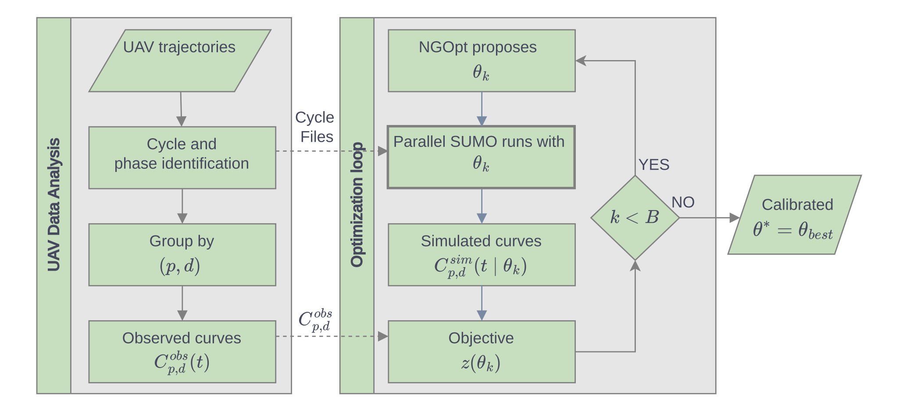
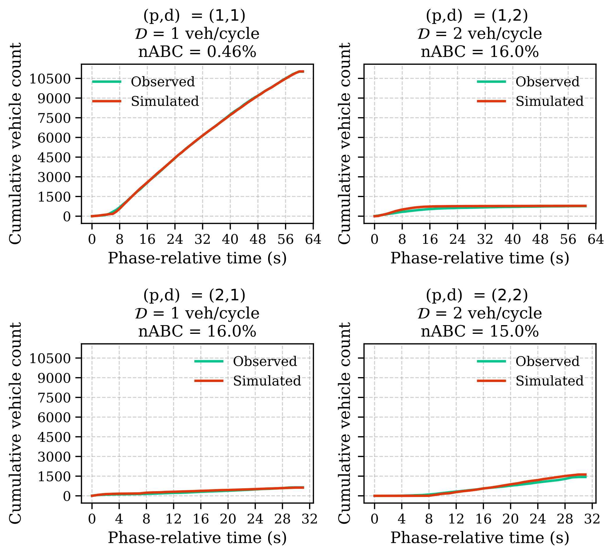
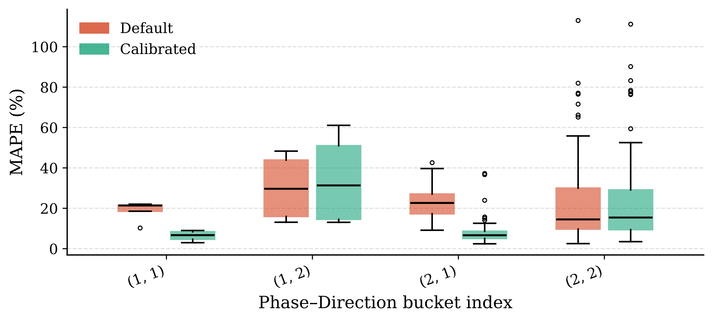

# A Cycle-Level Distribution-Based Calibration of Microscopic Intersection Models Using UAV Trajectories

<p align="center">
  
</p>

<p align="center">
  <b>Funded by the ERC project URANUS</b><br>
  <i>Real-Time Urban Mobility Management via Intelligent UAV-based Sensing</i>
</p>

<p align="center">
  <b>SUMO User Conference 2026</b><br>
  <i>Cycle-level calibration of microscopic intersection behavior using UAV trajectories</i>
</p>

---

## Overview

This repository contains the implementation and supplementary material for a **cycle-level, distribution-based calibration framework** for microscopic traffic simulation in **SUMO**.

The framework uses UAV-derived vehicle trajectories to calibrate signalized-intersection behavior at a higher temporal and operational resolution than aggregate traffic counts. Instead of matching only total link flows or average speeds, the method compares how vehicles exit the intersection **within each signal cycle, phase, and movement direction**.

The calibration target is a set of **phase-relative cumulative exit-count curves** constructed from observed UAV trajectories and simulated SUMO trajectories. These curves capture both the number of vehicles discharged and the timing of their discharge during each signal phase.

---

## Main Idea

Microscopic simulation errors at signalized intersections can propagate to larger networks through unrealistic queue discharge, turning behavior, spillback, and downstream arrivals. Traditional fixed sensors provide useful aggregate measurements, but they often do not observe the full spatial and temporal structure of intersection operations.

UAV trajectories provide a top-down view of the full intersection area. This makes it possible to observe:

* vehicle paths and turning movements,
* phase-dependent discharge behavior,
* exit times from the intersection,
* vehicle states at the start of each signal cycle,
* differences between observed and simulated discharge timing.

This repository implements a calibration framework that uses this information to tune SUMO behavioral parameters governing **car-following, lane-changing, sublane behavior, and junction interaction**.

---

## Methodological Contribution

The proposed framework:

1. Processes UAV trajectory data from a signalized intersection.
2. Infers signal phases and segments the observation horizon into cycles.
3. Assigns vehicles to phase–direction movement groups.
4. Computes phase-relative exit times.
5. Constructs cumulative exit-count curves for each phase–direction pair.
6. Runs SUMO independently for each observed cycle using UAV-derived initial states.
7. Compares observed and simulated cumulative curves using a distribution-based objective.
8. Calibrates SUMO behavioral parameters using derivative-free optimization.

The key modeling choice is the **cycle-level reinitialization** of SUMO simulations. Each cycle is initialized from UAV-derived vehicle positions and speeds, simulated independently, and then post-processed in the same way as the observed data. This reduces cycle-to-cycle error propagation, supports fragmented UAV observations, and enables parallel objective evaluation.

---

## Calibration Target

For each signal phase `p` and exit direction `d`, the framework builds a cumulative exit-count curve:

```math
C_{p,d}(t) = \sum_{\tau \in T_{p,d}} \mathbf{1}\{\tau \leq t\}
```

where:

* `T_{p,d}` is the set of phase-relative exit times,
* `t` is time measured relative to the start of the phase,
* `C_{p,d}(t)` is the cumulative number of vehicles that have exited by time `t`.

Observed UAV trajectories and simulated SUMO trajectories are processed using the same phase–direction grouping. Calibration then minimizes the discrepancy between observed and simulated cumulative exit-count curves.

---

## Objective Function

The calibration objective is a weighted average absolute deviation between observed and simulated cumulative curves:

```math
z(\theta) =
\sum_{p,d} w_{p,d}
\frac{1}{T_p + 1}
\sum_{t=0}^{T_p}
\left|
C^{obs}_{p,d}(t) - C^{sim}_{p,d}(t \mid \theta)
\right|
```

where:

* `θ` is the vector of SUMO parameters,
* `w_{p,d}` is the weight of each phase–direction pair,
* `C^{obs}_{p,d}` is the observed cumulative exit-count curve,
* `C^{sim}_{p,d}` is the simulated cumulative exit-count curve.

The objective is evaluated through microscopic simulation. It is nonlinear, noisy, and does not provide analytical gradients. Therefore, the calibration is performed using **NGOpt** from the **Nevergrad** library.

---

## Case Study

The framework is evaluated on the **Panepistimiou–Amerikis signalized intersection** in central Athens using UAV trajectory data from the **pNEUMA** experiment.

The study intersection includes:

* a multi-lane main approach along Panepistimiou Avenue,
* a cross-street along Amerikis Street,
* mixed traffic conditions with a substantial motorcycle presence,
* two reconstructed signal phases,
* two exit directions,
* four phase–direction calibration targets.

The corresponding SUMO network reproduces the intersection geometry, lane configuration, and signal-control structure. The modeled network extends beyond the UAV field of view to reduce artificial boundary effects near the calibrated intersection.

---

## Workflow

<p align="center">
  
</p>

The full workflow consists of two main parts.

### 1. UAV data processing

* Load UAV-derived vehicle trajectories.
* Identify vehicle movements and exit directions.
* Infer effective signal phases using virtual detector crossings.
* Segment the observation period into signal cycles.
* Extract cycle-start vehicle states.
* Construct observed phase-relative cumulative exit-count curves.

### 2. Simulation-based calibration

* NGOpt proposes a candidate SUMO parameter vector.
* Each observed cycle is initialized from UAV-derived vehicle states.
* SUMO simulates each cycle independently.
* Simulated exit times are grouped by phase and direction.
* Simulated cumulative curves are compared with observed curves.
* The objective value is returned to the optimizer.
* The process is repeated until the optimization budget is exhausted.

---

## Calibrated Parameter Space

The calibrated parameter vector includes both global and vehicle-type-specific SUMO parameters.

### Vehicle-type-specific parameters

The framework calibrates parameters for the following vehicle classes:

* car,
* motorcycle,
* taxi,
* bus,
* medium vehicle,
* heavy vehicle.

Typical calibrated parameters include:

* `speedFactor`,
* `speedDev`,
* `minGap`,
* `accel`,
* `decel`,
* `startupDelay`,
* `sigma`,
* `tau`.

### Global behavioral parameters

Global parameters include lane-changing, sublane, and junction-interaction behavior, such as:

* `lcPushy`,
* `lcImpatience`,
* `lcAssertive`,
* `lcSigma`,
* `minGapLat`,
* `jmDriveAfterRedTime`,
* `jmDriveAfterYellowTime`.

A preliminary sensitivity screening step is used to reduce the calibration dimension before running the full black-box optimization.

---

## Results

The calibrated model improves the reproduction of cycle-level discharge dynamics compared to SUMO default parameters.

Main findings:

* NGOpt shows stable convergence over 700 objective evaluations.
* The dominant phase–direction movement achieves **nABC = 0.46%**.
* The maximum cumulative deviation does not exceed **2 vehicles per cycle** for any phase–direction pair.
* Median cycle-level MAPE decreases by approximately **70%** for the higher-volume movements.
* Default SUMO parameters do not reproduce phase-level discharge behavior reliably, even when simulations are initialized from UAV-derived vehicle states.

<p align="center">
  
</p>

<p align="center">
  
</p>

---

## Repository Contents

This repository provides the code and supplementary files required to reproduce the calibration workflow, including:

* UAV trajectory processing scripts,
* signal phase and cycle segmentation routines,
* phase–direction grouping utilities,
* SUMO cycle-generation and execution scripts,
* objective-function evaluation,
* Nevergrad/NGOpt optimization setup,
* calibrated parameter files,
* diagnostic plots and result summaries.

Raw trajectory data may need to be obtained separately depending on the distribution conditions of the original UAV dataset.

---

## Reproducibility Notes

The framework is designed so that observed and simulated data are processed identically. For each candidate parameter vector:

1. SUMO is initialized separately for each cycle.
2. The same network and signal-control inputs are used.
3. Simulated vehicle exits are extracted.
4. Exit times are converted to phase-relative times.
5. Cumulative exit-count curves are constructed.
6. The objective value is computed from curve deviations.

This design makes the calibration suitable for fragmented UAV observations and allows cycle simulations to be executed in parallel.

---

## Keywords

`SUMO` · `UAV trajectories` · `microscopic simulation` · `traffic calibration` · `signalized intersections` · `pNEUMA` · `Nevergrad` · `NGOpt` · `distribution-based calibration` · `cycle-level calibration`

---

## Citation

If you use this repository, please cite:

```bibtex
@inproceedings{tsioutis2026cycle,
  title     = {A Cycle-Level Distribution-Based Calibration of Microscopic Intersection Models Using UAV Trajectories},
  author    = {Tsioutis, Charalambos and Pourgourides, Konstantinos and Timotheou, Stelios},
  booktitle = {SUMO User Conference 2026},
  year      = {2026}
}
```

---

## Authors

**Charalambos Tsioutis**
KIOS Research and Innovation Center of Excellence
University of Cyprus
[tsioutis.charalambos@ucy.ac.cy](mailto:tsioutis.charalambos@ucy.ac.cy)

**Konstantinos Pourgourides**
KIOS Research and Innovation Center of Excellence
University of Cyprus

**Stelios Timotheou**
KIOS Research and Innovation Center of Excellence
University of Cyprus

---

## Funding

This work is supported by the European Union through the ERC project **URANUS: Real-Time Urban Mobility Management via Intelligent UAV-based Sensing** and by the **KIOS Research and Innovation Center of Excellence**.

Views and opinions expressed are those of the authors only and do not necessarily reflect those of the European Union or the granting authorities.
